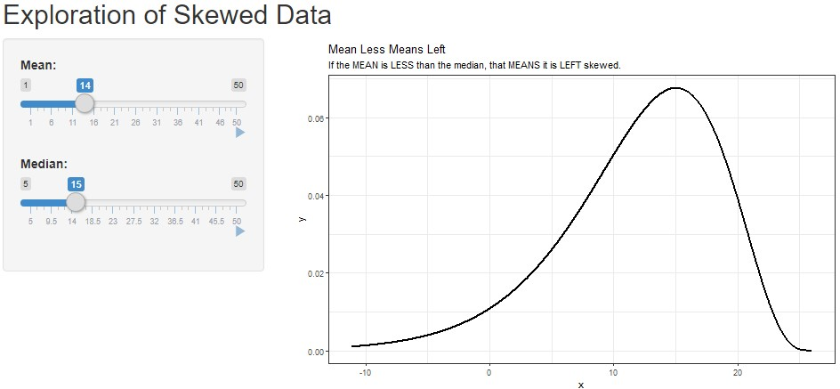
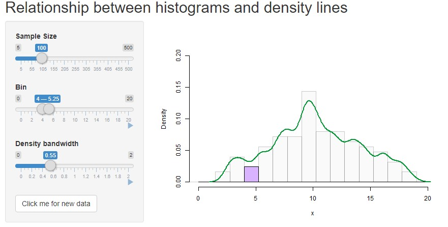

# DB7_TeachingApps

Some applications for self-discovery of statistical concepts and rules-of-thumb.

To run these, you may need to install `dplyr` and `ggplot2` packages. If you get a `... not found` message, you're probably missing a package.

You can copy and paste the code from here, or you can save `ScriptToRunApps.R` to your computer and run them from there.

### PoisBinApprox

The Poisson (and Normal) approximations to the binomial distributions. Includes sliders for sample size and probability of success. The Poisson distribution is useful when *p* is small, while the normal distribution is useful when both *np* and *n(1-p)* are larger than, say, 10 or so (this is a rule-of-thumb, not some magical value).


```r
shiny::runGitHub(repo = "DBecker7/DB7_TeachingApps", subdir = "PoisBinApprox")
```


### QQDistrFitting

Demonstration of the usefulness of QQ plots in assessing distributional assumptions. The app shows the histogram (with estimated density overlaid) and the qq-plot (which does *not* need an estimate of the parameters).

```r
shiny::runGitHub(repo = "DBecker7/DB7_TeachingApps", subdir = "QQDistrFitting")
```


### ScatterCorr

Shows what different correlations look like. Allows you to change the slope *independently* of the correlation, demonstrating that they're not the same thing. Allows for animation of the slope and correlation.

```r
shiny::runGitHub(repo = "DBecker7/DB7_TeachingApps", subdir = "ScatterCorr")
```


### MeanLessMeansLeft

How the mean and median affect the skew. Please note that it took me a while to figure out how to (efficiently) generate a Gamma distribution with a pre-specified mean and median.


```r
shiny::runGitHub(repo = "DBecker7/DB7_TeachingApps", subdir = "MeanLessMeansLeft")
```




### DensHist

A density plot can be found as the limit as n approaches infinity and te binwidth approaches 0. This tool lets students explore that while also exploring how the histogram changes with bin width and the density plot changes with bandwidth.

```r
shiny::runGitHub(repo = "DBecker7/DB7_TeachingApps", subdir = "DensHist")
```




## TODO

- Two-Way Tables (might just be teaching materials).
- Transformations of Random Variables
    - Demonstrate at least two x-values, show that the y-values stay the same
- Sampling distributions 
    - I probably can't do better than <a href="http://onlinestatbook.com/stat_sim/sampling_dist/">http://onlinestatbook.com/stat_sim/sampling_dist/</a>
- Marginal and conditional distributions (might just be teaching materials)
- Boxplot shapes
    - Boxplot compared to histogram, user chooses quartiles and I generate data between quartiles so that the boxplot has the same shape but the histogram looks completely different.
- Measures of spread
    - same idea as above, but generate data to have a pre-specified IQR and variance.
    - Method: generate data within quartiles according to a transformed beta distribition within Q2:Q3 and transformed exponential for the upper tail (mirrored across median). As variance slider changes, change parameters to select exact variance (maybe alpha = 1, beta increases by a fixed amount for Beta, lambda increases for exponential to make variance increase match slider).


# Spatial Stats Apps

The following apps are for my own exploration of spatial statistics. Simulating the data and exploring the parameters is my favourite way to comprehend the underlying concepts.

### Gaussian Processes

GPs are vital to any spatial processes with a Gaussian term, so this app helps to understand how the parameters affect the process.

```r
shiny::runGitHub(repo = "DBecker7/DB7_TeachingApps", subdir = "SpatialFun/GausProcess_Matern")
```

### Gaussian Fields

Like a Gaussian Process, but a field instead. Still based on Matern covariance.

```r
shiny::runGitHub(repo = "DBecker7/DB7_TeachingApps", subdir = "SpatialFun/GausField_Matern")
```


### TODO

- Exploration of INLA parameters (esp. penalized complexity).
- Description of INLA methods.
- Multiple realizations of a single gaussian field (both in terms of Geostatistics and Spatial Point Processes, maybe with Areal data).
- Generate random tesselations, show realizations of a continuous spatial process within those regions.


