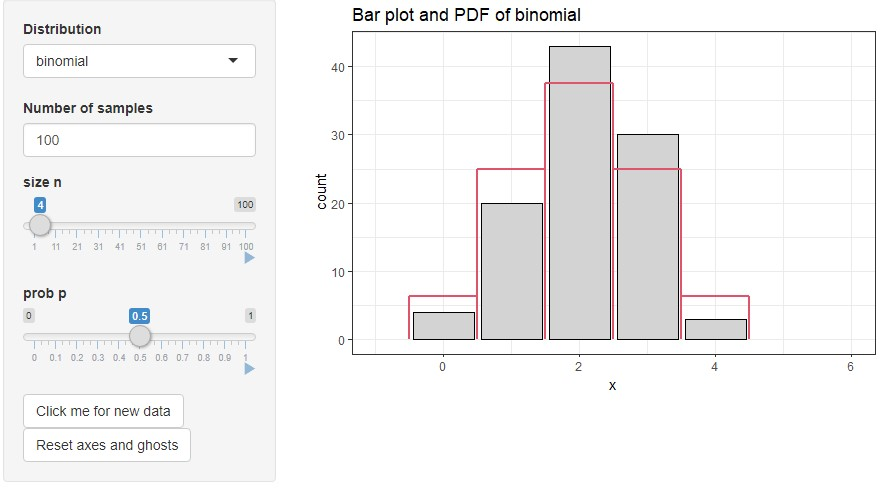
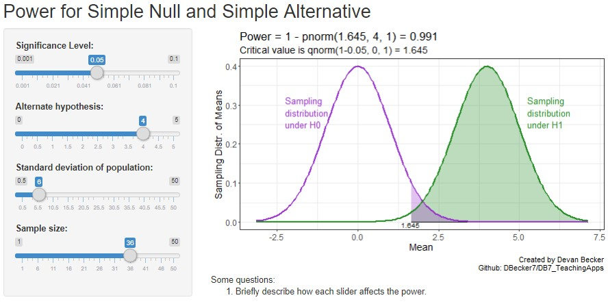
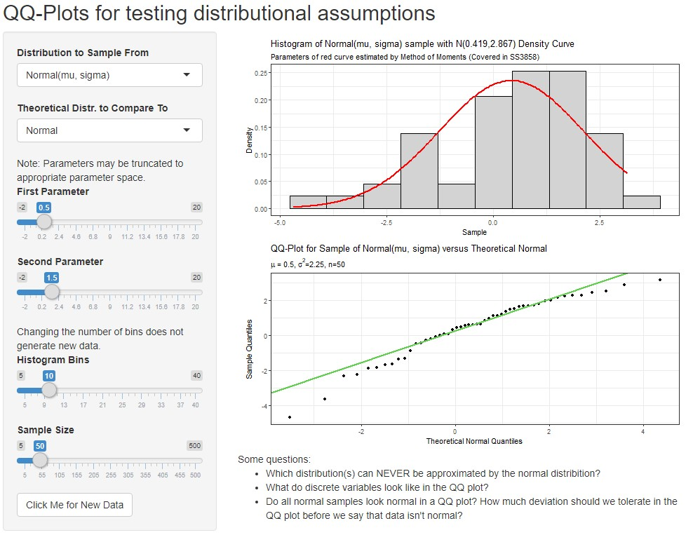
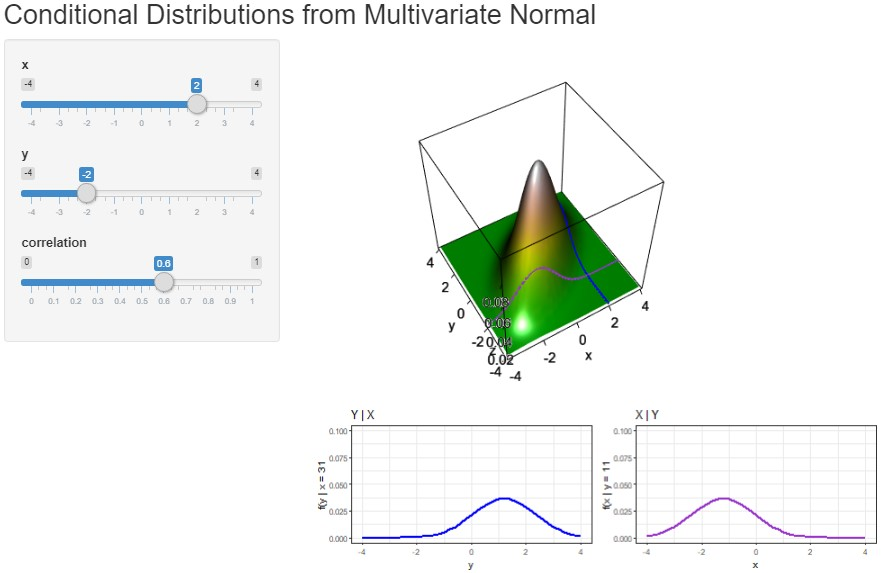
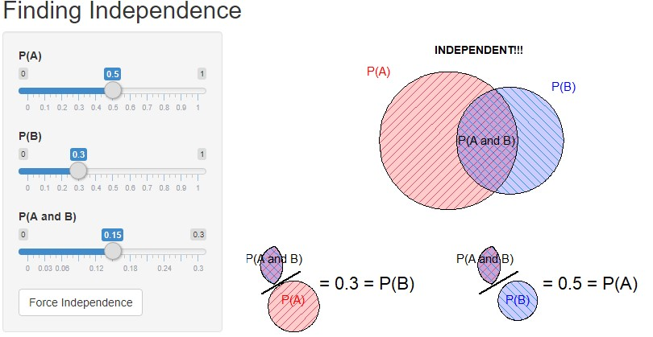
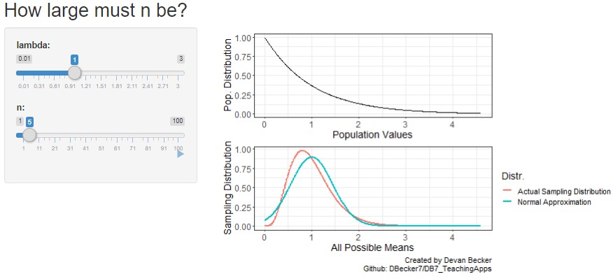
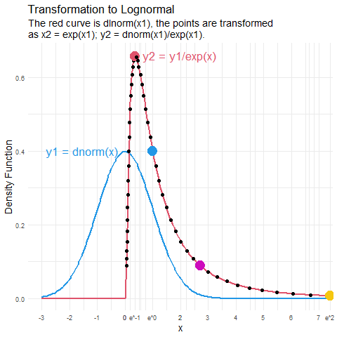
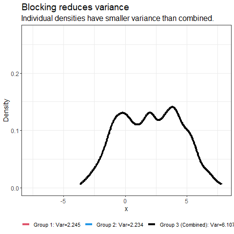
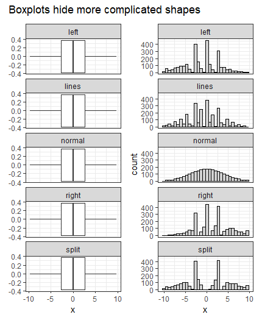

# Shiny Teaching Apps

Some applications for self-discovery of statistical concepts and rules-of-thumb. If you use these, let me know! Any suggestions for improvement can be raised in the Issues tab on GiHub. 

To run these, you may need to install `dplyr`, `ggplot2`, and `patchwork` packages. If you get a `... not found` message, you're probably missing a package.

You can copy and paste the code from here, or you can save <a href="https://github.com/DBecker7/DB7_TeachingApps/blob/master/ScriptToRunApps.R">`ScriptToRunApps.R`</a> to your computer and run them from there.

----


<!--
For Devan:

ggplot theming:
    theme(title = element_text(size = 16), axis.text = element_text(size = 14)) 
    caption = "Created by Devan Becker\nGithub: DBecker7/DB7_TeachingApps"

base R theming:
    mtext("Created by Devan Becker", side = 1, line = 3, adj = 1, cex = 0.8)
    mtext("Github: DBecker7/DB7_TeachingApps", side = 1, line = 4, adj = 1, cex = 0.8)
    
tags$div(HTML("Some questions:
<ol><li></li>
    <li></li>
    <li></li>
    <li></li>
</ol>"))

# From https://community.rstudio.com/t/shiny-slider-new-design/24765/4
# After fluidPage(
    tags$style(
        ".irs-bar {",
        "  border-color: transparent;",
        "  background-color: transparent;",
        "}",
        ".irs-bar-edge {",
        "  border-color: transparent;",
        "  background-color: transparent;",
        "}"
    ),
    
    
-->

## Quick Reference

- <a href="https://github.com/DBecker7/DB7_TeachingApps#tools">Tools</a>
    - <a href="https://github.com/DBecker7/DB7_TeachingApps#pnorm">pnorm</a>: Calculate and visualize normal probabilities.
    - <a href="https://github.com/DBecker7/DB7_TeachingApps#pvalues">pvalues</a>: Calculate and visualize p-values (normal distr).
    - <a href="https://github.com/DBecker7/DB7_TeachingApps#distrshapes">distrshapes</a>: How parameters affect shape of continuous distributions.
    - <a href="https://github.com/DBecker7/DB7_TeachingApps#distrshapes_disc">distrshapes_disc</a>: How parameters affect shape ofdiscrete distributions.
    - <a href="https://github.com/DBecker7/DB7_TeachingApps#simplepower">SimplePower</a>: Calculate power for simple null/alt (normal distr).
- <a href="https://github.com/DBecker7/DB7_TeachingApps#self-discovery-apps">Self-Discovery Apps</a>
    - <a href="https://github.com/DBecker7/DB7_TeachingApps#poisbinapprox">PoisBinApprox</a>: Poisson (and normal) approximation to the binomial.
    - <a href="https://github.com/DBecker7/DB7_TeachingApps#qqdistrfitting">QQDistrFittting</a>: QQ Plots to test distributional assumptions.
    - <a href="https://github.com/DBecker7/DB7_TeachingApps#scattercorr">ScatterCorr</a>: Scatterplots with a fixed correlation.
    - <a href="https://github.com/DBecker7/DB7_TeachingApps#meanlessmeansleft">MeanLessMeansLeft</a>: Generate distribution with fixed mean and median.
    - <a href="https://github.com/DBecker7/DB7_TeachingApps#denshist">DensHist</a>: Compare density plots to histograms.
    - <a href="https://github.com/DBecker7/DB7_TeachingApps#measurespread">MeasureSpread</a>: Fixed IQR and SD.
    - <a href="https://github.com/DBecker7/DB7_TeachingApps#poissoncatquant">PoissonCatQuant</a>: Barplots versus histograms.
    - <a href="https://github.com/DBecker7/DB7_TeachingApps#Conditionalnormal2">ConditionalNormal2</a>: Visualization of conditional distributions.
    - <a href="https://github.com/DBecker7/DB7_TeachingApps#indep">indep</a>: Visualization of independence.
    - <a href="https://github.com/DBecker7/DB7_TeachingApps#nlarge">nLarge</a>: How large must *n* be for CLT?.
    - <a href="https://github.com/DBecker7/DB7_TeachingApps#Z_or_t">Z_or_t</a>: How large must *n* be for normal p-value?.
- <a href="https://github.com/DBecker7/DB7_TeachingApps#animations">Animations</a>
    - <a href="https://github.com/DBecker7/DB7_TeachingApps#transform_norm">transform_norm</a>: Tansformation of a Normal to Lognormal
    - <a href="https://github.com/DBecker7/DB7_TeachingApps#BlockVariance">BlockVariance</a>: Blocking reduces variance.
- <a href="https://github.com/DBecker7/DB7_TeachingApps#credit-where-credit-is-due">Credit where credit is due</a>: Teaching materials that I can't beat.
- <a href="https://github.com/DBecker7/DB7_TeachingApps#spatial-stats-apps">Spatial Stats Apps</a>
    - <a href="https://github.com/DBecker7/DB7_TeachingApps#gausprocess_matern">GausProcess_Matern</a>: How Matern parameters affect a 1D Gaussian process.
    - <a href="https://github.com/DBecker7/DB7_TeachingApps#gausfield_matern">GausField_Matern</a>: How Matern parameters affect a 2D Gaussian process.
    - <a href="https://github.com/DBecker7/DB7_TeachingApps#spatialfunkfunction">SpatialFun/Kfunciton</a>: A for loop to create an animation of a K-function.

----


## Tools

### pnorm


- A simple app to calculate normal probabilities
- Displays the R code used in the title.
- -4 = -Inf, 4 = Inf

```r
shiny::runGitHub(repo = "DBecker7/DB7_TeachingApps", 
    subdir = "Tools/pnorm")
```

### pvalues


- Calculate p-values, given a z-statistic.
- See the difference in p-values for different hypotheses.
- Demonstrate why we double the p-value for two-sided, and why we use absolute values.

```r
shiny::runGitHub(repo = "DBecker7/DB7_TeachingApps", 
    subdir = "Tools/pvalues")
```

### distrshapes


- See how the shape changes with different parameters
- Axes are "sticky" - they increase to fit new data, but don't decrease until you change the distribution or click "Reset axes".
- The sampled data are also sticky - the seed only changes when the "New Data" button is pressed.

```r
shiny::runGitHub(repo = "DBecker7/DB7_TeachingApps", 
    subdir = "Tools/distrshapes")
```

### distrshapes_disc



- Discrete version of the app above.
- Ghosts are blue and fade away.
    - Max 10 ghosts before it gets laggy.

```r
shiny::runGitHub(repo = "DBecker7/DB7_TeachingApps", 
    subdir = "Tools/distrshapes_disc")
```

### SimplePower



- A visualization for power in the simple null/alternate situation.
    - Others have made this before, but this one is mine.
- Purple shaded area is Type 1 error, green shaded area is 1 - Type 2 error.

```r
shiny::runGitHub(repo = "DBecker7/DB7_TeachingApps", 
    subdir = "Tools/SimplePower")
```

----

## Self-Discovery Apps

### PoisBinApprox


- The Poisson (and Normal) are good approximations to the binomial distributions in different situations.  
- The Poisson distribution is useful when *p* is small, while the normal distribution is useful when both *np* and *n(1-p)* are larger than, say, 10 or so (this is a rule-of-thumb, not some magical value).
- Includes sliders for sample size and probability of success.


```r
shiny::runGitHub(repo = "DBecker7/DB7_TeachingApps", 
    subdir = "Apps/PoisBinApprox")
```

### QQDistrFitting




- Demonstration of the usefulness of QQ plots in assessing distributional assumptions. 
- The app shows the histogram (with estimated density overlaid) and the qq-plot (which does *not* need an estimate of the parameters).
- The theoretical distribution can be changed to something other than Normal (currently just Gamma).

```r
shiny::runGitHub(repo = "DBecker7/DB7_TeachingApps", 
    subdir = "Apps/QQDistrFitting")
```

### ScatterCorr


- Allows students to discover what different correlations look like. 
- Allows you to change the slope *independently* of the correlation, demonstrating that they're not the same thing. 
- Sliders (with animation) for the slope and correlation.
- Doesn't generate new data until specified, so animations allow the student to watch the correlation change.

```r
shiny::runGitHub(repo = "DBecker7/DB7_TeachingApps", 
    subdir = "Apps/ScatterCorr")
```


### MeanLessMeansLeft


- How the mean and median affect the skew. 
- Uses a Gamma distribution, so some parameter combos lead to a singularity at 0. 
- Please note that it took me a while to figure out how to (efficiently) generate a Gamma distribution with a pre-specified mean and median. I want credit for this.


```r
shiny::runGitHub(repo = "DBecker7/DB7_TeachingApps", 
    subdir = "Apps/MeanLessMeansLeft")
```


### DensHist


- Exploration of the connection between binwidth and bandwidth.
- A density plot can be found as the limit as n approaches infinity and the binwidth approaches 0. 
- This tool lets students explore that while also seeing how the histogram changes with binwidth and the density plot changes with bandwidth.

```r
shiny::runGitHub(repo = "DBecker7/DB7_TeachingApps", 
    subdir = "Apps/DensHist")
```

### MeasureSpread


- Explore the relationship between IQR and standard deviation.
- For the normal distribution, the IQR and sd have a consistent relationship. In particular, the sd is constant factor times the IQR, regardless of what the sd is!
- For real data, almost any (IQR, sd) pair is possible. 
    - I wrote a function to fix the IQR and perturb the data until I get the sd that I want. It doesn't always work perfectly.

```r
shiny::runGitHub(repo = "DBecker7/DB7_TeachingApps", 
    subdir = "Apps/MeasureSpread")
```

### PoissonCatQuant


- A histogram is just a bar chart where some of the bars are merged.
- For categorical data with a large number of categories, histograms are often preferred.
- If there aren't many categories, a bar chart may be better.
- This app makes use of the negative binomial distribution to show differing numbers of categories.
    - When the overdispersion is 0, this is a Poisson distribution.

```r
shiny::runGitHub(repo = "DBecker7/DB7_TeachingApps", 
    subdir = "Apps/PoissonCatQuant")
```

### ConditionalNormal2



- Demonstrating the concept of conditional distributions using the bivariate normal.
- Uses the `rgl` library to display the bivariate normal.
- Unfortunately, the rotation resets each time and I don't know how to fix this.
- ConditionalNormal also exists, which does not have an interactive 3D plot (uses static plots from `plot3D`).

```r
shiny::runGitHub(repo = "DBecker7/DB7_TeachingApps", 
    subdir = "Apps/ConditionalNormal2")
```

### indep



- Showing that independence doesn't look like anything special.
- When changing P(A) and P(B), P(A and B) is automatically set to a value that makes them independent.
- After that, P(A and B) can be changed.
- Things change when the user chooses disjoint sets or sets either P(A) or P(B) to 0

```r
shiny::runGitHub(repo = "DBecker7/DB7_TeachingApps", 
    subdir = "Apps/indep")
```


### nLarge



- A lot of places say that the normal approximation works when n is "Large", then say that 30 or 40 or 50 is large. 
- This app shows what happens in the most skewed distributions, and how the CLT still applies when the population is far from normal.
- Note that the normal approximation is actually biased, and this bias decreases as n increases.

```r
shiny::runGitHub(repo = "DBecker7/DB7_TeachingApps", 
    subdir = "Apps/nLarge")
```

### Z_or_t


- Another way to test what counts as a "large" n.
- Should you use the normal distribution or the t distribution?

```r
shiny::runGitHub(repo = "DBecker7/DB7_TeachingApps", 
    subdir = "Apps/Z_or_t")
```

## Animations

### transform_norm



Animation for transformation of normal to lognormal. 


```r
library(dplyr)
library(gganimate) # loads ggplot2

x1 <- seq(-3,3,0.1)
y1 <- dnorm(x1)
x2 <- exp(x1)
y2 <- y1/exp(x1)

# Testing
#plot(x2, y2)
#points(x1, y1)
#curve(dlnorm(x), add = TRUE, col = 2)

mydf <- bind_rows(
    data.frame(x = x1, y = y1, trans = "norm", 
        col = case_when(x1 == -1 ~ 1,
            x1 == 0 ~ 2, 
            x1 == 1 ~ 3, 
            x1 == 2 ~ 4, TRUE ~ 0)),
    data.frame(x = x2, y = y2, trans = "lnorm", 
        col = case_when(x2 == exp(-1) ~ 1,
            x2 == exp(0) ~ 2, 
            x2 == exp(1) ~ 3, 
            x2 == exp(2) ~ 4, TRUE ~ 0))
)

ggplot(mydf, aes(x = x, y = y,
        colour = factor(col), size = col > 0)) + 
    theme_minimal() + 
    scale_colour_manual(values = c(1,2,4,6,7)) + 
    scale_x_continuous(breaks = c(exp(-1), 0, exp(0), 
            2, exp(2), seq(-3,25,1)[-5]), 
        labels = c("e^-1", "0", "e^0", "2", "e^2", 
            seq(-3,25,1)[-5])) +
    transition_states(states = trans, 
        transition_length = 1/2, state_length = 1/2) +
    stat_function(fun = dnorm,  
        colour = 4, n = 500, size = 1) +
    stat_function(fun = dlnorm, 
        colour = 2, n = 500, size = 1) +
    geom_point() +
    coord_cartesian(xlim = c(-3,7)) +
    theme(legend.position = "none", 
        title = element_text(size = 14)) +
    annotate(geom = "text", x = c(0, exp(-1)), 
        y = c(0.4,0.66), 
        label = c("y1 = dnorm(x)", "y2 = y1/exp(x)"), 
        hjust = c(1.1,-0.1), size = 6, colour = c(4,2)) +
    labs(y = "Density Function", 
        title = "Transformation to Lognormal",
        subtitle = paste0("The red curve is dlnorm(x1),",
            "the points are transformed",
            "\nas x2 = exp(x1); y2 = dnorm(x1)/exp(x1)."))

anim_save("Animations/transform_norm.gif")
```

### BlockVariance



```r
library(gganimate)
set.seed(2112) # for reproducibility
g1 <- rnorm(400, 0, 1.5)
g2 <- rnorm(400, 4, 1.5)

# Density estimates with same range/bandwidth
g1dens <- density(g1, from = min(g1, g2),
    to = max(g1,g2), n = 400)
g2dens <- density(g2, from = min(g1, g2), 
    to = max(g1,g2), n = 400, bw = g1dens$bw)
g3dens <- density(c(g1,g2), from = min(g1, g2), 
    to = max(g1,g2), n = 400, bw = g1dens$bw)

# as a dataframe
gnames <- c(paste0("Group 1: Var=", round(var(g1), 3)), 
    paste0("Group 2: Var=", round(var(g2), 3)), 
    paste0("Group 3 (Combined): Var=", 
        round(var(c(g1, g2)), 3)))
allg <- data.frame(x = rep(g1dens$x, 3), 
    y = c(g1dens$y, g2dens$y, g3dens$y),
    group = rep(gnames, each = length(g1dens$x)))
allg$frame <- 1

# centered
allg2 <- allg
allg2$x <- c(g1dens$x - mean(g1), g2dens$x - mean(g2), 
    g3dens$x - mean(c(g1,g2)))
allg2$frame <- 2
ggplot(allg2, aes(x = x, y = y, colour = group)) + 
    geom_line()

# 0th frame - all densities together
allg0 <- data.frame(x = rep(g1dens$x, 3), 
    y = rep(g3dens$y, 3), 
    group = rep(gnames, each = length(g1dens$x)), 
    frame = 0)

all3 <- dplyr::bind_rows(allg, allg2, allg0)

ggplot(all3, aes(x = x, y = y, colour = group)) + 
    geom_line(size = 1.5) +
    scale_colour_manual(values = c(2, 4, 1)) + 
    transition_states(frame, wrap = FALSE) +
    theme_bw() +
    theme(legend.position = "bottom", 
        axis.title = element_text(size = 14), 
        title = element_text(size = 16),
        axis.text = element_text(size = 12),
        legend.text = element_text(size = 11)) + 
    labs(x = "x", y = "Density", colour = NULL,
        title = "Blocking reduces variance",
        subtitle = "Individual densities have smaller variance than combined.") 

anim_save("Animations/BlockVariance.gif")
```


----

## Credit where credit is due

**CLT:** This app is a classic, and there's no reason for me to top it. <a href="http://onlinestatbook.com/stat_sim/sampling_dist/">http://onlinestatbook.com/stat_sim/sampling_dist/</a>

**Importance of visualizations:** Ya can't beat the datasauRus dozen from https://www.autodeskresearch.com/publications/samestats. It's an update of Anscombe's quartet with even more interesting features. It's also a great way to demonstrate some tidyverse/ggplot2 functions!

The following code chunks are both standalone scripts. The resulting plots are good for demonstration.


```r
# Load some packages
library(datasauRus)
library(ggplot2)
# as always
theme_set(theme_bw()) 
library(dplyr)

# All of these plots have the same summary statistics,
    # including xbar, ybar, sd_x, sd_y, and correlation
data("datasaurus_dozen")
# remove a dataset for 3x4 plot
filter(datasaurus_dozen,
    dataset != "slant_up") %>% 
    ggplot(aes(x = x, y = y)) + 
        geom_point() + 
        facet_wrap(~ dataset, ncol = 3) +
        labs(title = "All have same summary statistics")

datasaurus_dozen %>% 
    group_by(dataset) %>% 
    summarise(m_x = mean(x), m_y = mean(y),
        s_x = sd(x), s_y = sd(y), r = cor(x,y)) %>% 
    knitr::kable(digits = 3)
```

|dataset    |    m_x|    m_y|    s_x|    s_y|      r|
|:----------|------:|------:|------:|------:|------:|
|away       | 54.266| 47.835| 16.770| 26.940| -0.064|
|bullseye   | 54.269| 47.831| 16.769| 26.936| -0.069|
|circle     | 54.267| 47.838| 16.760| 26.930| -0.068|
|dino       | 54.263| 47.832| 16.765| 26.935| -0.064|
|dots       | 54.260| 47.840| 16.768| 26.930| -0.060|
|h_lines    | 54.261| 47.830| 16.766| 26.940| -0.062|
|high_lines | 54.269| 47.835| 16.767| 26.940| -0.069|
|slant_down | 54.268| 47.836| 16.767| 26.936| -0.069|
|slant_up   | 54.266| 47.831| 16.769| 26.939| -0.069|
|star       | 54.267| 47.840| 16.769| 26.930| -0.063|
|v_lines    | 54.270| 47.837| 16.770| 26.938| -0.069|
|wide_lines | 54.267| 47.832| 16.770| 26.938| -0.067|
|x_shape    | 54.260| 47.840| 16.770| 26.930| -0.066|

**Boxplots hide shapes:** From the same people who brought you the datasaurus dozen!



```r
# I need a surprising amount of packages for this
library(datasauRus)
library(ggplot2)
theme_set(theme_bw()) # as always
library(dplyr)
library(patchwork)
library(tidyr)

data("box_plots")
# to make my code more compact (faceting)
box_plots_long <- pivot_longer(data = box_plots, cols = 1:5,
    names_to = "dataset", values_to = "x")

boxes <- ggplot(box_plots_long, aes(x = x)) + 
    geom_boxplot() + 
    facet_wrap(~ dataset, ncol = 1)
histos <- ggplot(box_plots_long, aes(x = x)) + 
    geom_histogram(colour = 1, fill = "lightgrey", bins = 30) + 
    facet_wrap(~ dataset, ncol = 1)
    
# patchwork is a magical package
boxes + histos +
    plot_annotation(
        title = "Boxplots hide more complicated shapes"
    )
```


----


## Spatial Stats Apps

The following apps are for my own exploration of spatial statistics. Simulating the data and exploring the parameters is my favourite way to comprehend the underlying concepts.

### GausProcess_Matern

GPs are vital to any spatial processes with a Gaussian term, so this app helps to understand how the parameters affect the process.

```r
shiny::runGitHub(repo = "DBecker7/DB7_TeachingApps", subdir = "SpatialFun/GausProcess_Matern")
```

### GausField_Matern

Like a Gaussian Process, but a field instead. Still based on Matern covariance.

```r
shiny::runGitHub(repo = "DBecker7/DB7_TeachingApps", subdir = "SpatialFun/GausField_Matern")
```

### SpatialFun/Kfunction

Animation (using a for loop and `Sys.sleep`, rather than being an image) of the calculation of the K-function. Can be found under SpatialFun/Kfunction.R.


