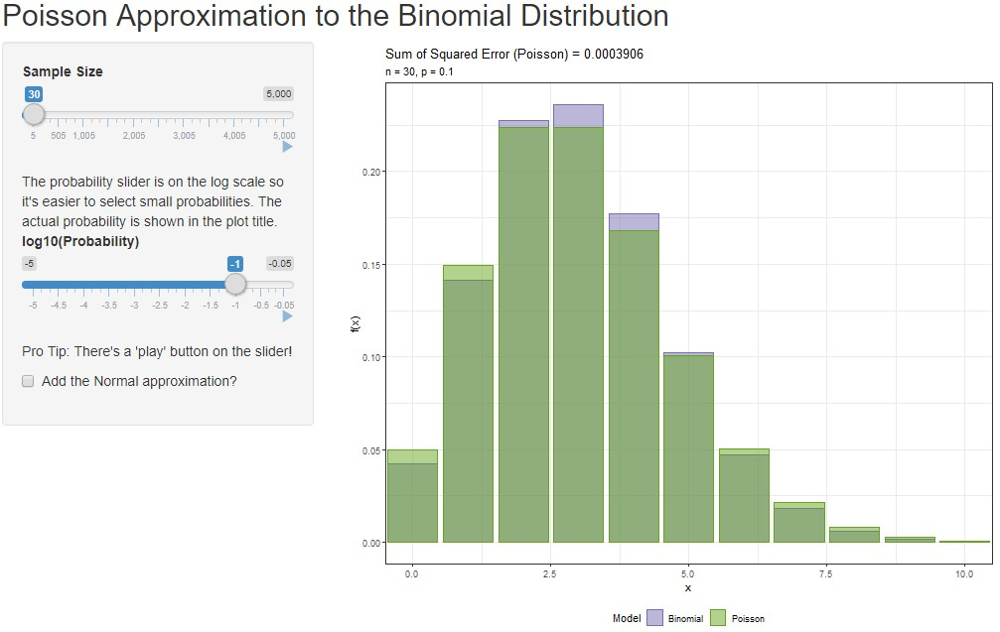
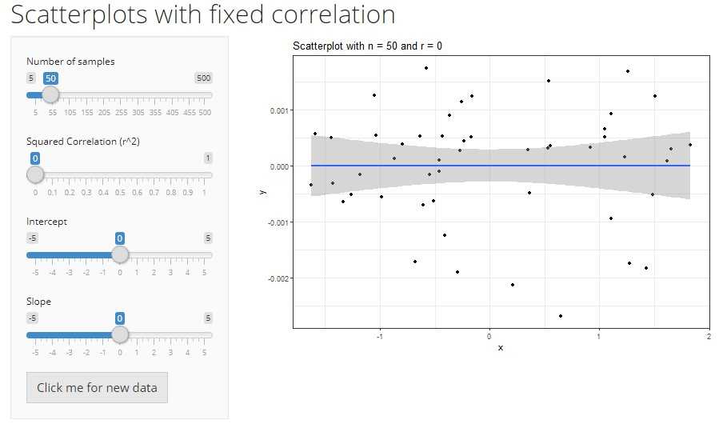

# DB7_TeachingApps

Some applications for self-discovery of statistical concepts and rules-of-thumb.

To run these, you may need to install `dplyr` and `ggplot2` packages. If you get a `... not found` message, you're probably missing a package.

### PoisBinApprox

The Poisson (and Normal) approximations to the binomial distributions. Includes sliders for sample size and probability of success. The Poisson distribution is useful when *p* is small, while the normal distribution is useful when both *np* and *n(1-p)* are larger than, say, 10 or so (this is a rule-of-thumb, not some magical value).


```r
shiny::runGitHub(repo = "DBecker7/DB7_TeachingApps", subdir = "PoisBinApprox")
```



### QQDistrFitting

Demonstration of the usefulness of QQ plots in assessing distributional assumptions. The app shows the histogram (with estimated density overlaid) and the qq-plot (which does *not* need an estimate of the parameters).

```r
shiny::runGitHub(repo = "DBecker7/DB7_TeachingApps", subdir = "QQDistrFitting")
```


### ScatterCorr

Shows what different correlations look like. Allows you to change the slope *independently* of the correlation, demonstrating that they're not the same thing.

```r
shiny::runGitHub(repo = "DBecker7/DB7_TeachingApps", subdir = "ScatterCorr")
```




# Spatial Stats Apps

### Gaussian Processes

GPs are vital to any spatial processes with a Gaussian term, so this app helps to understand how the parameters affect the process.

```r
shiny::runGitHub(repo = "DBecker7/DB7_TeachingApps", subdir = "SpatialFun/GausProcess_Matern")
```


